# 🏥 Dawa — Hospital Management System

A relational database project built with **Microsoft SQL Server (T-SQL)** that models the core operations of a hospital — from patient registration and appointment scheduling to billing, prescriptions, lab tests, and role-based security.

---

## 📋 Table of Contents

- [Overview](#overview)
- [Database Schema](#database-schema)
- [Features](#features)
- [SQL Modules](#sql-modules)
  - [Stored Procedures](#stored-procedures)
  - [Triggers](#triggers)
  - [Functions](#functions)
  - [Advanced Queries](#advanced-queries)
  - [Security & Roles](#security--roles)
- [Getting Started](#getting-started)
- [Sample Data](#sample-data)
- [Screenshots](#screenshots)

---

## Overview

**Dawa** is a hospital management database system designed to handle the full patient lifecycle — from the moment a patient books an appointment to the generation of a final bill. The project demonstrates real-world database design principles including normalization, referential integrity, business rule enforcement, and role-based access control.

**Tech Stack:** Microsoft SQL Server · T-SQL

---

## Database Schema

The system is built on **14 interrelated tables**:

| Table | Description |
|---|---|
| `VED_Departments` | Hospital departments (Cardiology, Neurology, etc.) |
| `VED_Doctors` | Doctors linked to departments with consultation fees |
| `VED_Schedules` | Weekly availability schedule for each doctor |
| `VED_Patients` | Patient demographic and insurance policy info |
| `VED_Insurance` | Insurance provider, coverage %, and yearly limits |
| `VED_Appointments` | Appointment records with status tracking |
| `VED_MedicalRecords` | Diagnosis and treatment plans per appointment |
| `VED_Medicines` | Medicine catalog with unit pricing |
| `VED_Prescriptions` | Medicines prescribed per medical record |
| `VED_LabTests` | Lab test catalog with base costs |
| `VED_LabOrders` | Lab tests ordered per appointment, with results |
| `VED_Billing` | Complete bill breakdown per appointment |
| `VED_Payment` | Payment records with method and date |

### Entity Relationship Overview

```
Departments ──< Doctors ──< Schedules
                  │
                  └──< Appointments >── Patients >── Insurance
                            │
                  ┌─────────┴──────────┐
                  │                    │
            MedicalRecords         LabOrders >── LabTests
                  │
            Prescriptions >── Medicines
                  │
              Billing
                  │
              Payment
```

---

## Features

- **Appointment Management** — Book, track, and update appointment status (Scheduled / Completed / Cancelled)
- **Medical Records** — Diagnoses, treatment plans, and follow-up flags per visit
- **Prescriptions & Lab Orders** — Linked to medical records with dosage, quantity, and test results
- **Automated Billing** — Bills generated automatically when an appointment is marked Completed
- **Insurance Integration** — Coverage percentage applied as a discount during billing
- **GST Calculation** — 18% GST applied on all bills
- **Role-Based Access Control** — Five database roles with granular permissions
- **Business Rules Enforced** — Via `CHECK` constraints, triggers, and stored procedures

---

## SQL Modules

### Stored Procedures

| Procedure | Description |
|---|---|
| `sp_MonthlyDepartmentReport` | Appointments, unique patients, and consultation revenue per department for a given month/year |
| `sp_PatientBillingStatement` | Full itemised billing history for a patient with `ROLLUP` grand total |
| `sp_DoctorPerformanceReport` | Completion rate and revenue for doctors with ≥ 5 appointments in a date range |
| `sp_UnprescribedMedicines` | Lists medicines in the catalog that have never been prescribed |
| `sp_MonthlyRevenueTargetReport` | Compares monthly revenue against a ₹5,00,000 target with surplus/deficit using `ROLLUP` |

### Triggers

| Trigger | Event | Description |
|---|---|---|
| `trg_PreventDoubleBooking` | `AFTER INSERT, UPDATE` | Prevents two appointments for the same doctor at the same date and time |
| `trg_AutomateBilling` | `AFTER UPDATE` | Automatically creates a bill when an appointment is marked `Completed`, calculating medicine costs, lab costs, insurance discounts, and GST |
| `trg_ScheduleFollowUp` | `AFTER INSERT, UPDATE` | Automatically schedules a follow-up appointment 7 days later when a medical record has `RequiresFollowUp = 1` |

### Functions

| Function | Description |
|---|---|
| `fn_GetPatientAge` | Calculates a patient's exact age from their `DateOfBirth` using `DATEDIFF` with birthday-correction logic |
| `fn_CalculateNetBill` | Computes the net bill from consultation, medicine, and lab costs — applying GST (18%) and insurance discount |

### Advanced Queries

| Query | Technique Used |
|---|---|
| **Top 3 Revenue Doctors per Department** | `DENSE_RANK()` window function with `PARTITION BY` department |
| **Running Monthly Revenue Total** | `SUM() OVER()` cumulative window function |

### Security & Roles

Five database roles are defined with the principle of least privilege:

| Role | Access |
|---|---|
| `db_receptionist` | Manage patients & appointments; denied billing and clinical data |
| `db_doctor` | Read patients/appointments; full access to medical records, prescriptions, and lab orders; denied billing |
| `db_lab_tech` | View lab tests/orders; column-level UPDATE on results only; denied patient personal data |
| `db_billing` | Manage billing and payments; accesses patients only through a restricted view (`vw_PatientInsuranceInfo`); denied medical/prescription data |
| `db_admin` | Full `db_owner` access |

A restricted view `vw_PatientInsuranceInfo` exposes only name and insurance data to the billing role, protecting sensitive medical information.

---

## Getting Started

### Prerequisites
- Microsoft SQL Server 2019 or later
- SQL Server Management Studio (SSMS) or Azure Data Studio

### Setup

1. **Clone the repository**
   ```bash
   git clone https://github.com/vedantt-22/Dawa-Hospital-Management-System.git
   cd Dawa-Hospital-Management-System
   ```

2. **Run the scripts in the following order** inside SSMS:

   ```
   1. SQL Queries/Schema_Design.sql          ← Creates all tables and inserts sample data
   2. SQL Queries/Functions & Advanced Queries.sql  ← Creates UDFs and runs analytical queries
   3. SQL Queries/Stored_Procedure.sql       ← Creates all stored procedures
   4. SQL Queries/Trigger.sql                ← Creates all triggers
   5. SQL Queries/Security & Roles.sql       ← Creates roles, views, and permissions
   ```

> ⚠️ Run `Schema_Design.sql` first — all other scripts depend on the tables it creates.

---

## Sample Data

The schema script seeds the database with:

- **5 Departments** — Cardiology, Orthopaedics, Pathology, Pediatrics, Neurology
- **7 Doctors** across all departments
- **5 Patients** with varying insurance coverage (0%, 50%, 80%, 100%)
- **15+ Appointments** across multiple dates
- **Medical records, prescriptions, lab orders, and billing entries** to demonstrate all features

---

## Screenshots

<table>
  <tr>
    <td>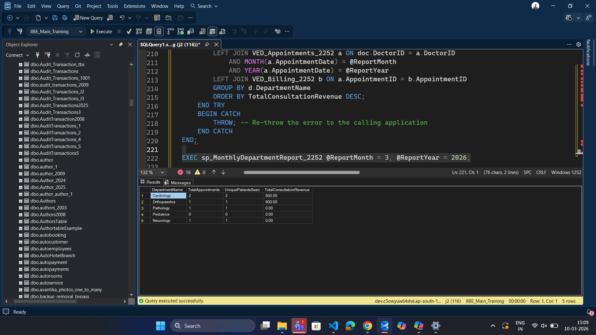</td>
    <td>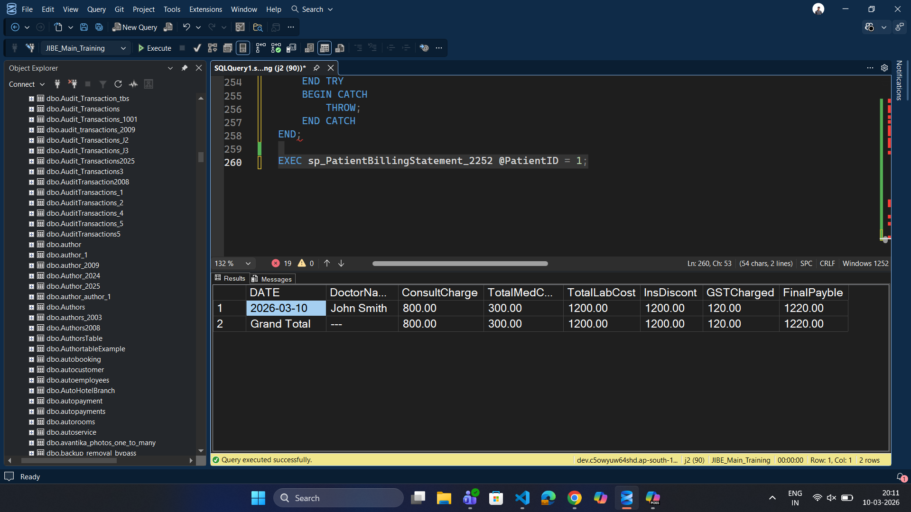</td>
  </tr>
  <tr>
    <td>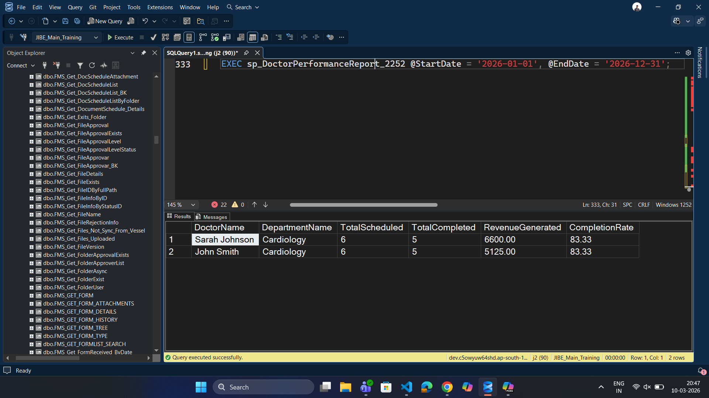</td>
    <td>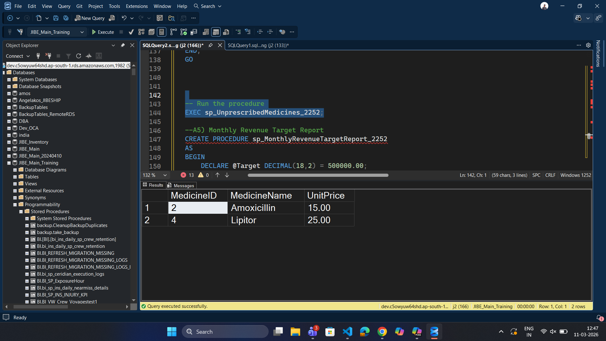</td>
  </tr>
  <tr>
    <td>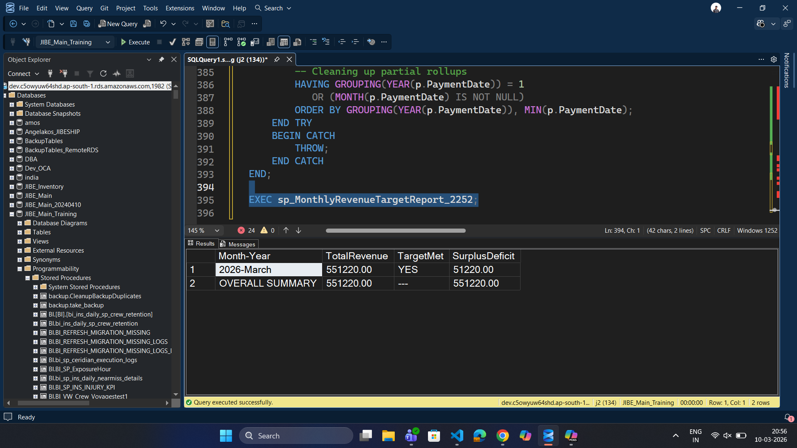</td>
    <td>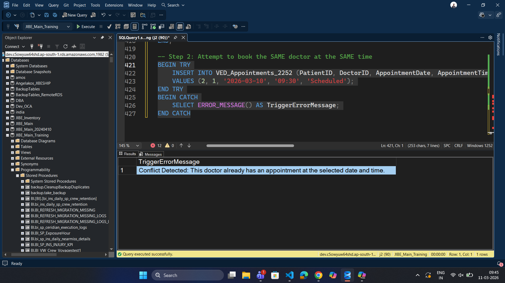</td>
  </tr>
  <tr>
    <td>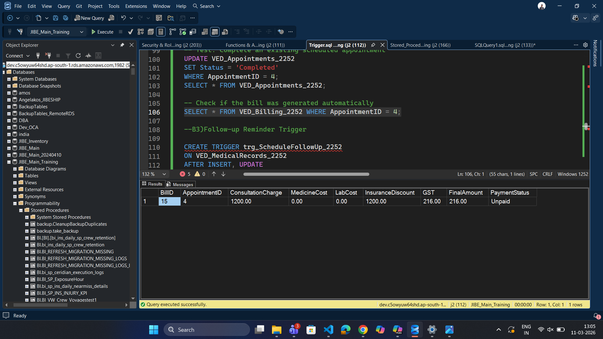</td>
    <td>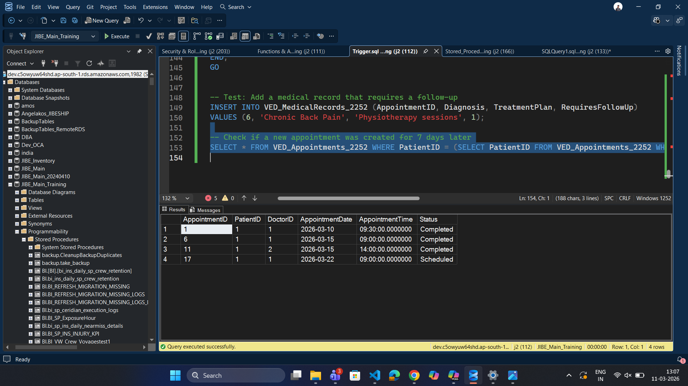</td>
  </tr>
  <tr>
    <td>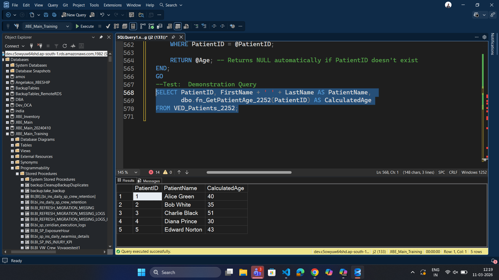</td>
    <td>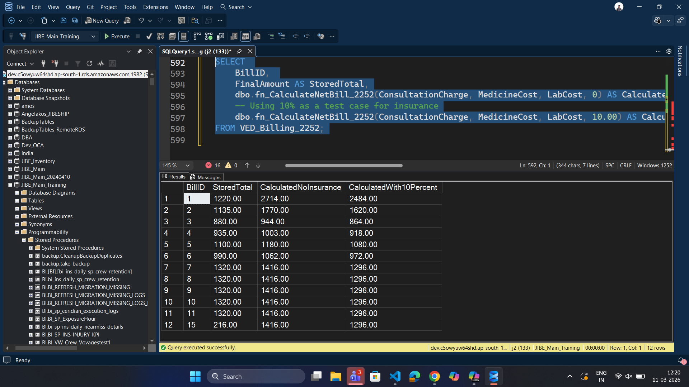</td>
  </tr>
  <tr>
    <td>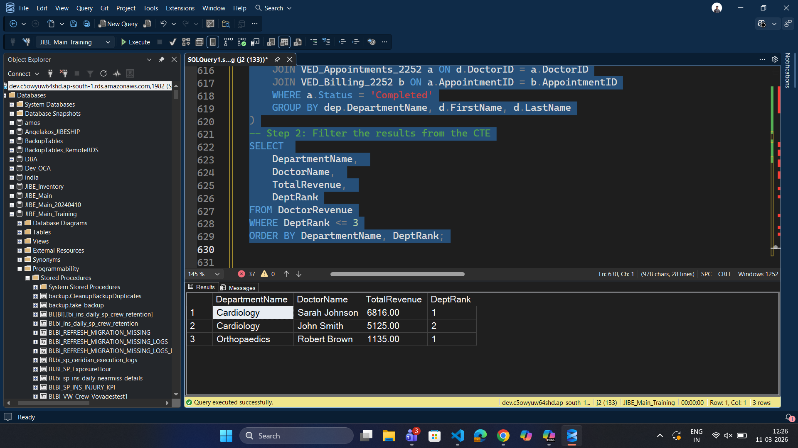</td>
    <td>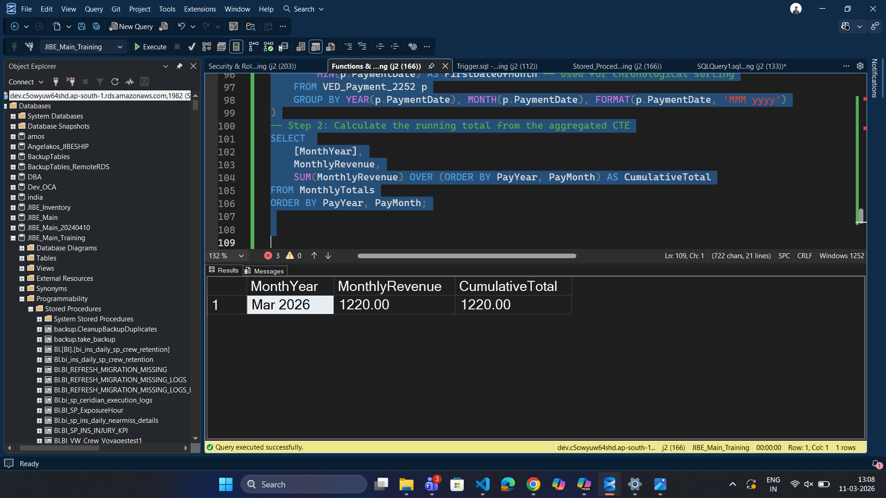</td>
  </tr>
</table>

---

> Built as part of a database management systems project — demonstrating schema design, business logic enforcement, and SQL Server best practices.
